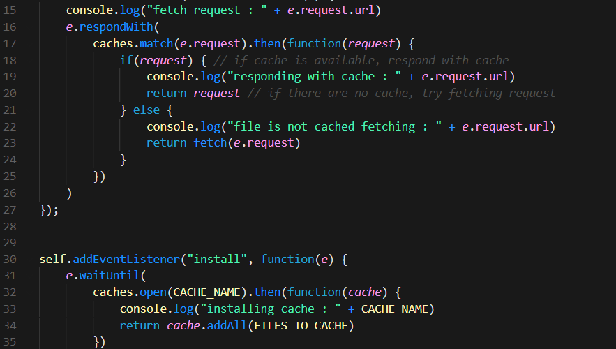

# Progressive Budget Billet
  
## Description
This repository contain the partial, almost complete, script of a budget tracker progressive web application. Ultimately this application is designed to track the users budget on the fly, however, it is still in develpment.

## User Story
* AS AN avid traveler

* I WANT to be able to track my withdrawals and deposits with or without a data/internet connection

* SO THAT my account balance is accurate when I am traveling 

## Table of Contents
- [Built With](#languages)
- [Source Code Screenshot](#Code)
- [Usage](#Usage)
- [Contribution](#contributing)
- [Questions](#questions)

## Built With
* JavaScript
* HTML
* CSS

## Source Code Screenshot

## Usage
This application is deployed to Heroku [Here](https://progressive-budget-billet.herokuapp.com/) : However, it doesn not work due to incompletion

## Contribution
- This project was made by Evan Carlson and contains references and material learned in the University of Minnesota Web Dev Bootcamp.

- The starter code repository, made by [Xandromus](https://github.com/Xandromus), can be accessed [HERE](https://github.com/coding-boot-camp/symmetrical-bassoon)

Since this app is not fully functional, contribution ARE being accepted at this time. Please refer to section below for contact information.

## Questions
If you have any questions on this application, feel free to reach me through my GitHub profile [epc318](https://github.com/epc318) or [E-mail](carl4917@umn.edu):

### ©️2022  Budget Bears, Inc.